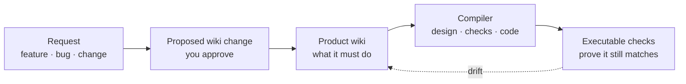

<p align="center">
  
</p>

<h1 align="center">Product Wiki</h1>

<p align="center">
  <strong>Making English a programming language.</strong>
</p>

<p align="center">
  <a href="https://www.npmjs.com/package/product-wiki"></a>
  <a href="https://github.com/omarismailb/product-wiki/actions/workflows/wiki-checks.yml"></a>
  <a href="LICENSE"></a>
  <a href="package.json"></a>
</p>

---

Product Wiki is an open-source harness for building software with coding agents.
It is especially useful for non-technical builders who want to build complex products without the codebase turning messy.

## Contents

| Section | What it covers |
| --- | --- |
| [Why Product Wiki exists](#why-product-wiki-exists) | The product layer missing from most coding-agent workflows. |
| [Quick start](#quick-start) | Install Product Wiki in a repo and start through Codex or Claude Code. |
| [How the loop works](#how-the-loop-works) | Request, proposal, wiki update, compiler, and checks. |
| [What the wiki records](#what-the-wiki-records) | The product units that sit above the codebase. |
| [What's in the harness](#whats-in-the-harness) | The folders, scripts, schemas, routines, and examples in this repo. |
| [The point](#the-point) | Why this makes agent-built software easier to keep coherent. |
| [Read more](#read-more) | The full essay and docs. |

## Why Product Wiki exists

Coding agents are becoming very good at turning natural language into production-grade code.
The problem is that they mostly reason from the current codebase and the current chat thread.
Code records **how** a product was built. It does not reliably record **why** it was built, **what** it is meant to do, or **which decisions** sit behind it.

**The missing layer is a product wiki: a natural-language abstraction layer above the codebase.**
**It records what the product is supposed to do, why it works that way, and what must stay true as the code changes.**

**You do not write or maintain this wiki by hand. The agent drafts it from your normal request, and the loop skills keep it in sync with the code as the product changes. You review and approve.**

A request, such as a new feature, bug report, or workflow change, becomes a small wiki change first. Nothing reaches code until the product change is clear. A compiler then turns that approved change into design decisions, executable checks, and the smallest safe code change.

The result is more consistent software: one product picture, clearer requirements, cleaner boundaries, fewer duplicate paths, less tech-stack drift, and less code that works today but collapses under the next change.

## Quick start

From the root of the repo you want Product Wiki in:

```bash
npx product-wiki@latest init
```

That installs the managed harness, activates routing in `AGENTS.md` / `CLAUDE.md` without touching your local rules, adds `pw:*` scripts when the repo has a `package.json`, and runs the checks.
In a repo with no `package.json`, run the gate directly with `node scripts/product-wiki-check.mjs`.
Then open the repo in Claude Code or Codex and describe what you want to build. It routes through a proposal before any code.

Pin a version (`npx product-wiki@2.3.1 init`) for a reproducible install. Use `sync` instead of `init` to upgrade later, and `--dry-run` to preview.

## How the loop works



You still talk to the agent normally. You never author the wiki yourself: `propose-change` drafts it, `apply-wiki-change` updates it once you approve, and the loop skills keep it in sync as the code changes. Instead of going straight to code, the harness runs a short chain of skills:

| Step | What happens |
| --- | --- |
| `propose-change` | Clarifies the request, asks the material questions one at a time, and drafts a small wiki change. |
| `apply-wiki-change` | Updates the product wiki once you approve. |
| `compile-change` | Turns the approved change into design decisions, executable checks, the smallest safe code change, and verification. |
| `routine-runner` and `ratchet-lint` | Run deterministic loops that fail when approval, check, or anchor coverage slips backwards. |
| `reconcile-wiki` | Fixes safe links and raises a proposal when the wiki, checks, architecture, or code drift apart. |

## What the wiki records

The wiki breaks the product into small linked units.
`wiki/overview.md` is the whole-product map an agent reads first.

| Unit | What it captures |
| --- | --- |
| Actors, jobs, and stories | Who the product serves and what they are trying to do. |
| Acceptance criteria and rules | What must be true for the product to behave correctly. |
| Journeys and capabilities | How the product works across flows and reusable abilities. |
| Decisions | Why important trade-offs were made. |
| Outcomes, non-goals, assumptions, and risks | What matters, what is out of scope, what is uncertain, and what could go wrong. |
| Glossary terms | Shared language the agent should use consistently. |

## What's in the harness

| Path | Purpose |
| --- | --- |
| `wiki/` | The managed product wiki scaffold and design-system notes. |
| `intake/` | Proposal templates and raw requests before they reach the wiki. |
| `templates/` | Starter files for proposals, wiki units, compiler plans, and check manifests. |
| `schemas/` | JSON schemas that keep proposals, wiki units, checks, and maps structured. |
| `routines/` | Drift checks for architecture, traceability, design, and wiki health. |
| `scripts/` | CLI gates, lint loops, sync tools, and repair helpers. |
| `checks/` | Baselines and manifests for executable verification. |
| `examples/` | Populated examples that show Product Wiki in use. |
| `docs/` | Install, upgrade, lifecycle, distribution, loops, and comparison notes. |

## The point

The aim is practical determinism. It does not make the model deterministic. It pins down the behaviour a change must produce, so there is less room for the agent to invent the architecture while it writes the code.

The checks run against the code. Otherwise the wiki becomes another stale document with more confidence around it.

It works whether you are starting a new product, wrapping an existing codebase, or adding a feature to a mature system.

## Read more

The full write-up, with a worked example, is here: [Making English a Programming Language](https://omarismail.com/projects/making-english-a-programming-language).

For install, upgrade, the maintenance loops, and how it compares, see [`docs/`](docs/).

For what has changed between releases, see [`CHANGELOG.md`](CHANGELOG.md).

## Status

This is an early release, hardening as it is used against real changes.
This repo's own `wiki/` is intentionally minimal scaffolding, so running `npm run check` here proves the tooling runs, not that a populated wiki holds together. The `examples/` directory shows populated proposals.

## Contributing

Contributions are welcome while the shape is still settling. Start with [`CONTRIBUTING.md`](CONTRIBUTING.md), keep changes small, and run `npm run check` before opening a pull request. By participating you agree to the [Code of Conduct](CODE_OF_CONDUCT.md).

## License

MIT. See [`LICENSE`](LICENSE).
